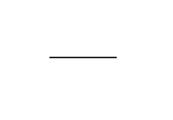
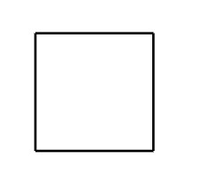

# Desain Fungsi dalam Julia

Materi yang dibahas dalam modul ini erat kaitannya dengan prinsip pemrograman berorientasi objek (PBO). Namun jangan khawatir, jika anda merupakan pemula, anda tetap dapat mengikuti pembahasan dalam modul ini.

Kita akan melakukan desain interaksi antar fungsi dalam `Julia` menggunakan modul `ThinkJulia` (Ref: [ThinkJulia](https://benlauwens.github.io/ThinkJulia.jl/latest/book.html)) yang merupakan referensi seluruh modul yang ada pada repositori ini. Modul berisi kumpulan fungsi-fungsi yang saling terkait. Pengembangan sebuah modul dilakukan untuk meningkatkan kemampuan fungsi-fungsi bawaan dalam `Julia` Standard Library. Modul-modul tambahan ini dikembangkan bersama oleh komunitas dan selalu berkembang. Kalian dapat mengakses modul-modul yang dikembangkan oleh komunitas pada tatuan berikut [JuliaObserver](https://juliaobserver.com/packages).

Untuk dapat digunakan, Modul (atau sering juga disebut sebagai *package*) dapat dipasang pada REPL dengan mengganti ke mode `PkgREPL` dengan mengetikkan simpol kurung siku tutup <kbd>]</kbd> sehingga muncul perintah baru dalam REPL yaitu `pkg>`.

```bash
(@v1.6) pkg> 
```

Setelah masuk dalam mode `PkgREPL`, ketikkan perintah berikut diakhiri <kbd>ENTER</kbd>:

```bash
(@v1.6) pkg> add https://github.com/BenLauwens/ThinkJulia.jl
```

Pemasangan modul membutuhkan waktu, kalian dapat menunggunya hingga selesai. Setelah pemasangan modul selesai, untuk keluar dari mode `PkgREPL`, kalian dapat menekan tombol <kbd>Backspace</kbd>. Setelah itu, tampilan REPL akan kembali menjadi tampilan konsol interaktif.

Untuk menggunakan modul, kita dapat menggunakan kata kunci `using` dilanjutkan dengan nama modul yang ingin digunakan.

```bash
julia> using ThinkJulia
[ Info: Precompiling ThinkJulia [a7f2b756-c18b-4c7f-87da-faca9ac81b29]
[ Info: Skipping precompilation since __precompile__(false). Importing ThinkJulia [a7f2b756-c18b-4c7f-87da-faca9ac81b29].
```

Perhatikan bahwa pesan yang ditampilkan pada layar setelah berhasil menggunakan modul `ThinkJulia` dapat berbeda pada tiap komputer. 

Selanjutnya, mari kita coba membuat variabel 🐢 (kura-kura) yang diberikan nilai berupa objek `Turtle`. Simbol 🐢 dapat ditulis dengan mengetikkan `\:turtle:` dan <kbd>TAB</kbd> pada konsol interaktif julia, dengan catatan anda telah mengaktifkan modul `ThinkJulia` seperti yang sudah dilakukan sebelumnya. Perhatikan bahwa setelah diberikan nilai, variabel 🐢 berisi objek `Turtle` dengan kondisi awal seperti berikut.

```bash
julia> 🐢 = Turtle()
Turtle(0.0, 0.0, true, 0.0, (0.0, 0.0, 0.0))
```

Jika dideskripsikan secara sederhana, objek `Turtle` ini terletak di pusat kanvas dan membawa sebuah pena untuk menggambar. Pada kondisi awal, objek ini menghadap ke arah timur dari kanvas. Coba perhatikan pemanggilan fungsi berikut.

```bash
julia> @svg begin
       forward(🐢, 100)
       end
"luxor-drawing-152144_034.svg"
```

Kata kunci `@svg begin` pada bagian awal pemanggilan fungsi menandakan bahwa kita akan memulai menggambar pada sebuah kanvas dan luarannya nanti akan berupa gambar dengan format `svg` (vektor). Kemudian, perhatikan bahwa objek `Turtle` ini menjadi parameter dari pemanggilan fungsi `forward`. Fungsi `forward` bertujuan untuk menggerakkan objek yang diberikan pada argumen pertama (dalam hal ini objek `Turtle`). Objek bergerak ke arah depan (dalam hal ini bergerak ke arah Timur) sejauh 100 piksel. Semestinya, luaran gambar yang dihasilkan sesuai dengan contoh berikut.

<!---->


Bagaimana jika kita ingin menggambar sebuah sudut siku-siku dengan menggunakan objek `Turtle` ini? Perhatikan pemanggilan fungsi berikut.

```bash
julia> 🐢 = Turtle()
Turtle(0.0, 0.0, true, 0.0, (0.0, 0.0, 0.0))
julia> @svg begin
       forward(🐢,100)
       turn(🐢,-90)
       forward(🐢,100)
       end
"luxor-drawing-152452_076.svg"
```

Untuk menggambar sudut siku-siku, setelah objek `Turtle` bergerak ke depan, kita perintahkan objek `Turtle` untuk berbalik menghadap ke Utara. Fungsi `turn` mengubah arah objek sehingga menghadap beberapa derajat (paramter kedua) dari kondisi awal. Nilai negatif, misalnya $-x$ dari sudut arah menandakan bahwa objek menghadap $x$ derajat berlawanan dengan arah jarum jam. Setelah objek berubah arahnya, kembali kita memanggil fungsi `forward`. Berikut contoh gambar yang dihasilkan.

<!---->


Jika kita mengulang komposisi pemanggilan fungsi `forward` dan `turn` sebanyak 4 kali, kita dapat membentuk sebuah persegi! Perhatikan pada contoh berikut ini kita membuat fungsi `square` yang menerima sebuah objek `t`, dimana objek yang diharapkan adalah `Turtle`.

```bash
julia> function square(t)
       for i in 1:4
       forward(t,100)
       turn(t,-90)
       end
       end
square (generic function with 1 method)
julia> 🐢 = Turtle()
Turtle(0.0, 0.0, true, 0.0, (0.0, 0.0, 0.0))
julia> @svg begin
       square(🐢)
       end
"luxor-drawing-153210_346.svg"
```

Berikut gambar yang dihasilkan dari pemanggilan fungsi `square`.

<!---->


Setelah kita berhasil menggambar persegi hanya dengan memanfaatkan kombinasi pemanggilan fungsi `forward` dan `turn`. Kita bisa meng-generalisasi kombinasi pemanggilan kedua fungsi ini untuk menggambar poligon (bentuk segi banyak).

```bash
julia> function polygon(t, n, len)
       angle = 360 / n
       for i in 1:n
       forward(t, len)
       turn(t, -angle)
       end
       end
polygon (generic function with 1 method)
julia> 🐢 = Turtle()
Turtle(0.0, 0.0, true, 0.0, (0.0, 0.0, 0.0))
julia> @svg begin
       polygon(🐢, 7, 70)
       end
"luxor-drawing-153727_52.svg"
```

Contoh hasil menaggambar segi 7 (Heptagon).

<!---->


Bahkan kita bisa memanfaatkan kembali fungsi `polygon` diatas untuk membuat lingkaran.

```bash
julia> function circle(t, r)
       circumference = 2 * π * r
       n = 100
       len = circumference / n
       polygon(t, n, len)
       end
circle (generic function with 1 method)
julia> 🐢 = Turtle()
Turtle(0.0, 0.0, true, 0.0, (0.0, 0.0, 0.0))
julia> @svg begin
       circle(🐢, 100)
       end
"luxor-drawing-155459_185.svg"
```

Semakin besar nilai `n` yang didefinisikan pada fungsi `circle`, kita mendapatkan lingkaran yang lebih halus.


